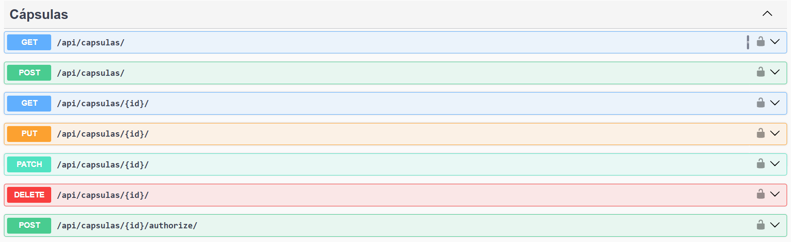
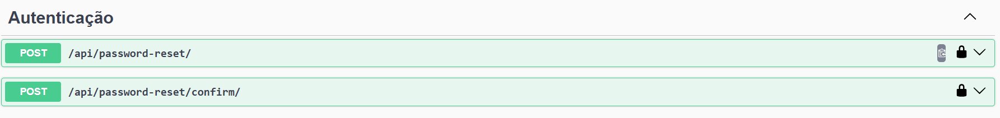
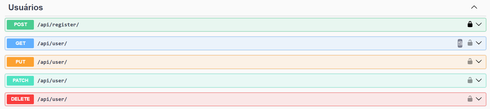
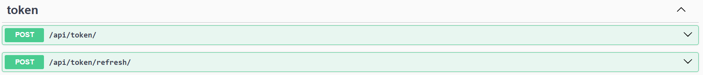

# INF1407 - Capsula do Tempo (Backend)
Este projeto é uma aplicação web desenvolvida para a disciplina de Programação para a Web na PUC-Rio. A plataforma permite que utilizadores criem "cápsulas digitais" com mensagens e conteúdos que só poderão ser abertos em datas futuras específicas.

## Grupo
* **Julia Gomes Zibordi** 
* **Marcos Paulo Marinho Vieira**

---

## Escopo do projeto
A **Cápsula do Tempo** foi concebida como uma ferramenta de preservação de memórias digitais. O foco principal do desenvolvimento foi criar uma interface autêntica, simulando o envio de envelopes físicos.

**O que foi desenvolvido no backend:**
- Sistema de gestão de cápsulas e de usuários (CRUD completo).
- Recuperação de senha através do envio de e-mails via terminal.
- Controle de acesso por usuário com endpoints protegidos.
- Deploy do backend.

Tudo o que foi desenvolvido está funcionando. 

## Instruções de uso

### 1. Acesso via site
Para testar o backend pelo Swagger, acesse o link:
👉 **()**

### 2. Execução em ambiente local
Caso deseje rodar o backend em sua máquina, certifique-se de que tem o Python instalado e siga os passos a seguir. 

```bash
# 1. Clonar o repositório
git clone https://github.com/MarcosVieira71/INF1407---Capsula-do-Tempo-backend.git

# 2. Instalar dependências necessárias
pip install -r requirements.txt

# 3. Aplicar as migrações do banco de dados
python manage.py migrate

# 4. Iniciar o servidor local
python manage.py runserver

````

Depois disso, acesse *(http://127.0.0.1:8000/api/docs/)* para testar o backend pelo Swagger. 

## Visão geral dos endpoints
### 1. Cápsulas
É necessário autenticação por token para acessar todos os endpoints relativos às cápsulas. 

 

### 2. Autenticação


### 3. Usuários


### 4. Token
